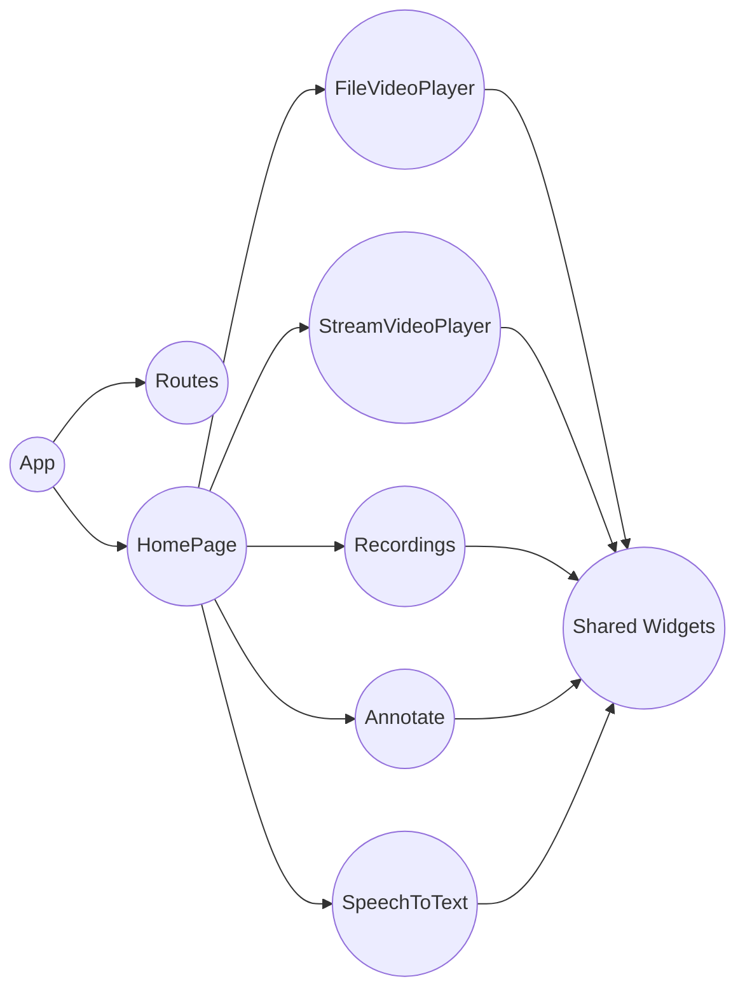
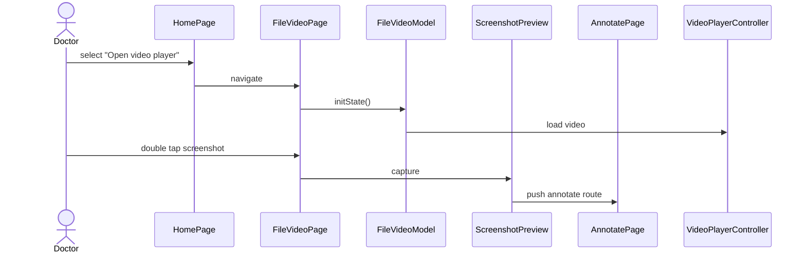
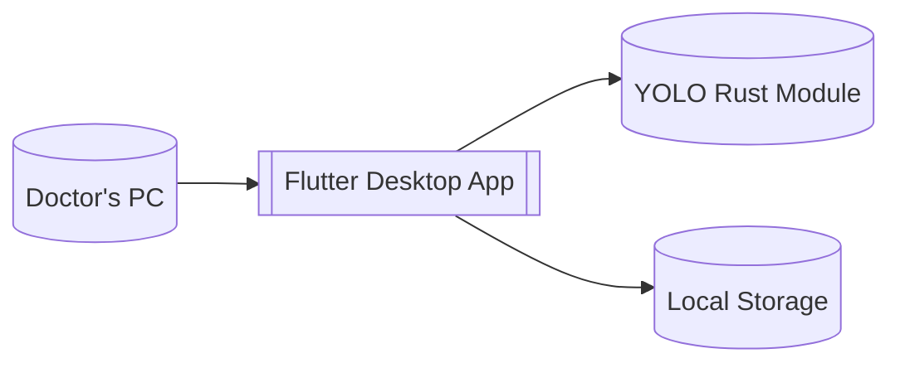

[![Contributors][contributors-shield]][contributors-url]
[![Forks][forks-shield]][forks-url]
[![Stargazers][stars-shield]][stars-url]
[![Issues][issues-shield]][issues-url]

# EndoscopeAi

**Interactive support tool for endoscopic surveys**  
for Pirogov Clinic of High Medical Technologies at St Petersburg University

## Overview  
This application is designed to support doctors during endoscopic examinations.  
It helps to efficiently capture and annotate videos and images, record and structure findings, and use AI for real-time or post-procedure analysis.

## AI-powered features  
The app integrates advanced AI technologies, including YOLO (You Only Look Once), to assist medical professionals by:
- Providing real-time image recognition and anomaly detection during endoscopic procedures  
- Assisting with annotation and classification of findings  
- Enhancing diagnostic accuracy and reducing review time
- Continuously improving models based on collected data and feedback

## Development

### Kanban board
The team tracks work using a [GitHub Project board](https://github.com/uSs3ewa/EndoscopeBETA/projects/1).
Issues move across the following columns:

| Column | Entry criteria |
| ------ | -------------- |
| **Backlog** | Newly created issues or feature ideas. |
| **Ready** | Prioritized tasks ready for development. |
| **In Progress** | Work is actively being done on the issue. |
| **Review** | A pull request is open and awaiting approvals. |
| **Done** | The pull request is merged and the issue closed. |

### Git workflow
Our workflow is adapted from GitHub flow:

1. Create an issue using the templates under `.github/ISSUE_TEMPLATE`.
2. Label and assign the issue.
3. Create a feature branch from `main` named `issue-<number>-short-desc`.
4. Commit changes using the `type(scope): summary` format.
5. Open a pull request using `.github/pull_request_template.md`.
6. At least one reviewer must approve before merging.
7. Merge the pull request after CI passes and close the linked issue.

See the [Git workflow diagram source](docs/git_workflow.mmd) for a visual overview.

We use GitHub issue templates to track work. For bugs please use `.github/ISSUE_TEMPLATE/bug_report.md` and for new features use `.github/ISSUE_TEMPLATE/feature_request.md` when opening issues.

### Secrets management
Secrets such as API keys or credentials should be stored in environment variables or provided through Flutter/Dart `--dart-define` parameters and in GitHub Actions secrets.
`.env` or other files containing secrets must be added to `.gitignore` and never committed to the repository.

### Automated tests
This project uses Flutter tests located in:

- `test/unit_test` – unit tests
- `test/widget_test` – widget tests
- `test/integration_test` – integration tests

### Continuous Integration
The workflow defined in
[`\.github/workflows/flutter-ci.yml`](.github/workflows/flutter-ci.yml)
runs on GitHub Actions. It consists of three jobs:

1. **build-test** – runs on Ubuntu, installs Flutter, performs code analysis and
   executes unit and integration tests.
2. **build-windows** – runs on Windows and validates a debug build with
   `flutter build windows`.
3. **release-win** – triggered on tags matching `MVPv*`; after the other jobs
   succeed it builds the Windows release, zips the output and attaches it to the
   GitHub Release.

Static analysis tools:
- `flutter analyze`
- `dart format`

Test commands:
- `flutter test`
- `flutter test integration_test`See the run history on
[GitHub Actions](https://github.com/uSs3ewa/EndoscopeBETA/actions).

### Continuous Deployment
When a tag matching `MVPv*` is pushed, the `release-win` job builds the Windows
release, compresses it into `EndoscopeAI.zip`, and attaches the archive to the
corresponding GitHub Release.

## Quality

### Performance efficiency
#### Time behaviour
This app must react quickly during procedures so doctors are not kept waiting. Capturing a screenshot and opening the annotation view should feel instant.

*Quality attribute scenario*
- **Stimulus**: the doctor double taps a screenshot during playback
- **Environment**: desktop build on the clinic PC
- **Response**: the annotation view opens
- **Response measure**: view appears within 500 ms

See [screenshot_double_tap_test.dart](test/integration_test/screenshot_double_tap_test.dart).

### Usability
#### Operability
Medical staff need to navigate between screens with minimal training. Simple navigation keeps the focus on the patient rather than the tool.

*Quality attribute scenario*
- **Stimulus**: the user taps “Open video player” on the home page
- **Environment**: running on a standard desktop
- **Response**: the recordings page is displayed
- **Response measure**: page loads ready for interaction

See [home_navigation_test.dart](test/integration_test/home_navigation_test.dart).

### Reliability
#### Availability
The application should start reliably whenever it is needed for an examination.

*Quality attribute scenario*
- **Stimulus**: the operator launches the app
- **Environment**: clinic PC
- **Response**: the main window loads
- **Response measure**: loads without error

See [app_load_test.dart](test/integration_test/app_load_test.dart).

## Architecture

### Static view
The codebase is organised by pages, each with a model and view. Shared widgets provide common UI elements. A Rust module handles YOLO inference via a Flutter bridge.

The loose coupling between pages through the routing table keeps dependencies manageable and improves maintainability.

### Dynamic view
The following sequence occurs when a doctor opens a video and annotates a screenshot. On our production machine this flow takes under two seconds.

### Deployment view
The application is distributed as a Flutter desktop build. YOLO inference is packaged with the app and runs locally on the doctor's workstation.

The customer installs by extracting the release archive and launching the bundled executable. No external services are required.

(<a href="#readme-top">back to top</a>)

[contributors-shield]: https://img.shields.io/badge/Contributors-7-blue
[contributors-url]: https://github.com/GooseKIller/EndoscopeAi/graphs/contributors
[forks-shield]: https://img.shields.io/badge/Forks-2-red
[forks-url]: https://github.com/GooseKIller/EndoscopeAi/forks
[stars-shield]: https://img.shields.io/badge/Stars-2-yellow
[stars-url]: https://github.com/GooseKIller/EndoscopeAi/stargazers
[issues-shield]: https://img.shields.io/badge/Issues-7-purple
[issues-url]: https://github.com/GooseKIller/EndoscopeAi/issues
[license-shield]: https://img.shields.io/github/license/othneildrew/Best-README-Template.svg?style=for-the-badge
[license-url]: https://github.com/GooseKIller/EndoscopeAi/blob/main/LICENSE
